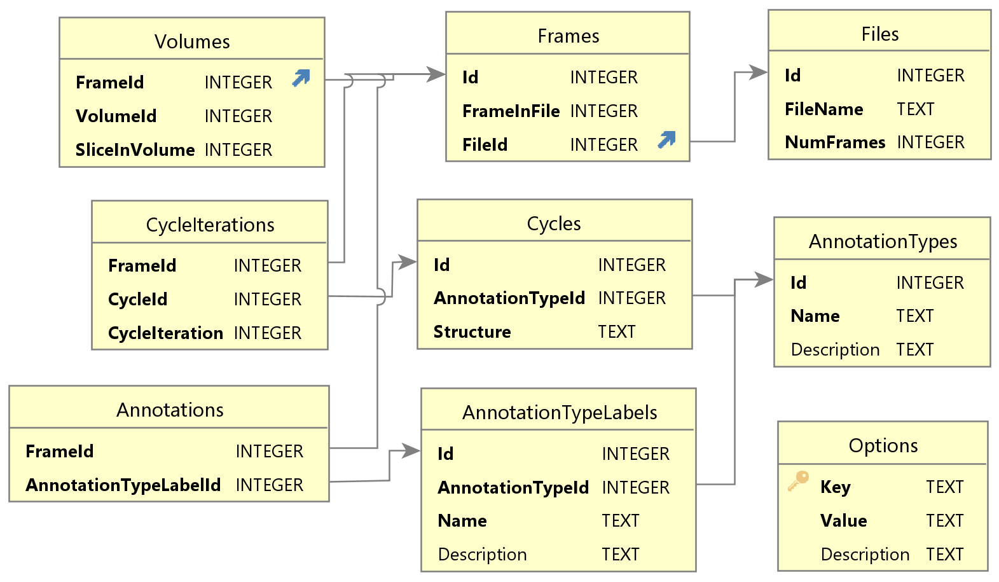

# Database

Vodex stores the information about the experiment in a SQLite database.

There are the following tables:

- { align=right width=700 }`Files` : stores the filenames relative to the main directory (`FileName`) and number of frames in each file (`NumFrames`)
- `AnnotationTypes`: stores the types of annotations (`Name`) and descriptions (`Description`) which is optional.
- `Frames`: links each frame in the experiment to the file (`FileId`) and a frame in that file (`FrameInFile`)
- `Cycles`: IF the annotation (`AnnotationTypeId`) was created from a cycle, stores the cycle as a json string (`Structure`)
- `AnnotationTypeLabels`: for each annotation type (`AnnotationTypeId`) stores the names of the labels (`Name`) and their descriptions (`Description`) which are optional.
- `Volumes`: links each frame in the experiment (`FrameId`) to the volume (`VolumeId`) and a slice in that volume (`SliceInVolume`)
- `CycleIterations`: links each frame in the experiment (`FrameId`) to the cycle (`CycleId`) and the iteration of that cycle (`CycleIteration`)
- `Annotations`: links each frame in the experiment (`FrameId`) to the label (`AnnotationTypeLabelId`)
- `Options`: stores some additional information as a `Key` - `Value` pair. Contains the following keys:
    - `data_dir`: the directory with the image Files
    - `frames_per_volume`: frames per volume parameter
    - `num_head_frames`: number of frames at the beginning of the recording that do not form a full volume
    - `num_tail_frames`: number of frames at the end of the recording that do not form a full volume
    - `num_full_volumes`: number of full volumes in the recording

See diagram for more details.

You can explore each table in more details using the [database for the Toy Dataset]([GitHub](https://github.com/LemonJust/vodex/blob/main/src/vodex/_tests/data/test.db)). We recommend using a [DB Browser for SQLite](https://sqlitebrowser.org/) to explore the database content. It is also a good place to test out your queries if you want to add some functionality to the [dbmethods module](https://lemonjust.github.io/vodex/api/dbmethods/).
