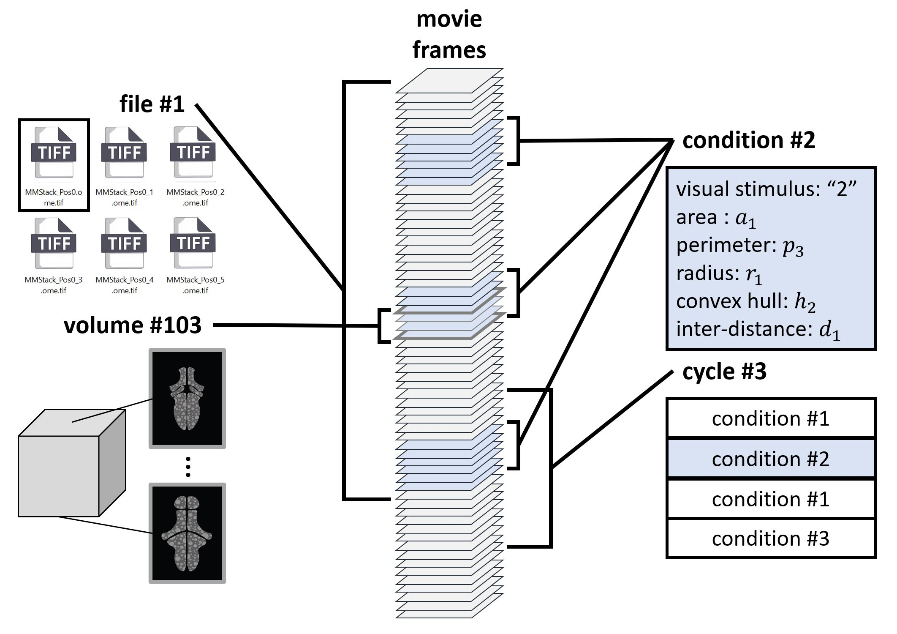

# VoDEx: <u>Vo</u>lumetric <u>D</u>ata and <u>Ex</u>periment Manager

TEST TEST TEST Vodex is a Python library for dealing with volumetric movies , written as a sequence of slices and split across multiple tif files.
It will keep track of full volumes / particular z-slices, making it easy to do requests like " give me all z slices # 23 in the whole movie" , or " give me volumes # 6, 85 and 54 ", regardless of whether these volumes are split between multiple tif files, or not. It can also link particular experimental conditions to certain volumes/slices, making it easy to request something like " give me all full volumes when I was shining the green light " or " give me all slices # 16 after we have administered the drug ".
<p align="center">
  
</p>

## Installation

Use the package manager [pip](https://pypi.org/project/vodex/) to install vodex.

```bash
pip install vodex
```
## How-To Guides
To get started with `VoDEx`,
please see notebooks/examples in [How-To Guides](how-to-guides.md) or on [github](https://github.com/LemonJust/vodex).

## Reference
[Reference](reference.md) contains the technical implementation of the `VoDEx` project code.

## License
[MIT](https://choosealicense.com/licenses/mit/)
