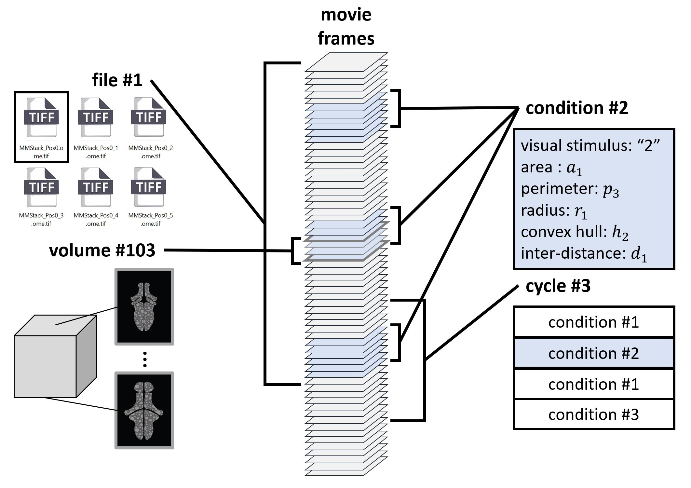

# VoDEx: <u>Vo</u>lumetric <u>D</u>ata and <u>Ex</u>periment Manager

Recent advances in fluorescent microscopy and genetically-encoded calcium indicators made it possible
to acquire large-scale 3D-time series datasets of brain activity. During these recordings, experimental
conditions can vary: subjects can be presented with different stimuli and/or demonstrate different
behavior. It is then required to annotate the data based on these experimental conditions and select the
recording time of interest for the subsequent analysis. Data annotation is usually done manually or using
a custom code deeply integrated with the analysis pipeline. Manual annotation is prone to error and is
hard to document. Custom code often requires loading the whole dataset into the memory or depends
on the exact file representation of data on a disc, which is not optimal for large datasets.

We introduce VoDEx, volumetric data and experiment manager, a data management tool that integrates
the information about the individual image frames, volumes, volume slices, and experimental conditions
and allows retrieval of sub-portions of the 3D-time series datasets based on any of these identifiers. It is
implemented as a napari plugin for interactive usage with a GUI and as an open-source Python package
for easy inclusion into analysis pipelines.

<p align="center">
  
</p>

## Installation

Use the package manager [pip](https://pypi.org/project/vodex/) to install vodex.

```bash
pip install vodex
```
## How-To Guides
To get started with `VoDEx`,
please see notebooks/examples in [How-To Guides](how-to-guides.md) or on [github](https://github.com/LemonJust/vodex).

## Reference
[Reference](user_guide/index.md) contains the technical implementation of the `VoDEx` project code.

## License
[MIT](https://choosealicense.com/licenses/mit/)
